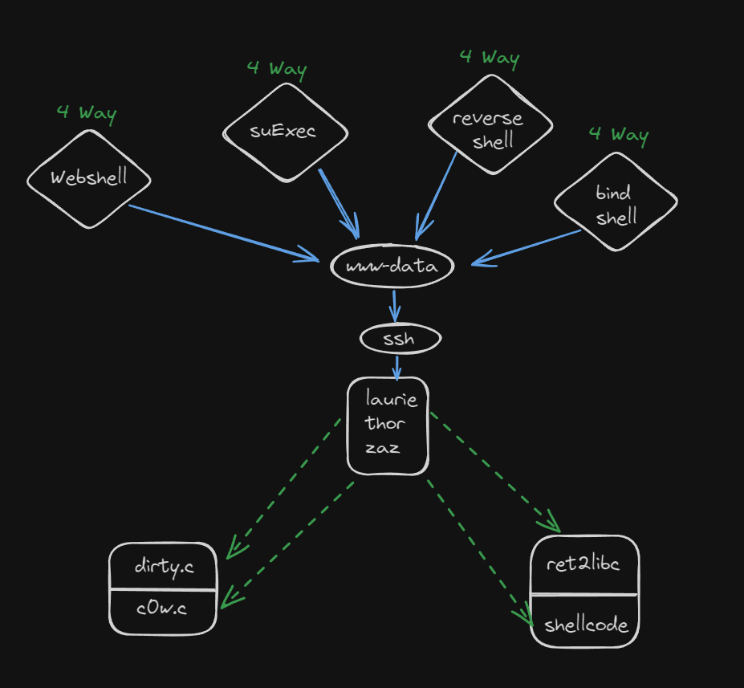

# Boot2Root

## Project Overview

Boot2Root is a cyber security project that focuses on finding and exploiting vulnerabilities in a virtual machine to gain root access. The aim is to understand various penetration testing techniques and system security concepts.

## Tools That Will Be Useful

- Nmap
- Dirb
- Custom scripts
